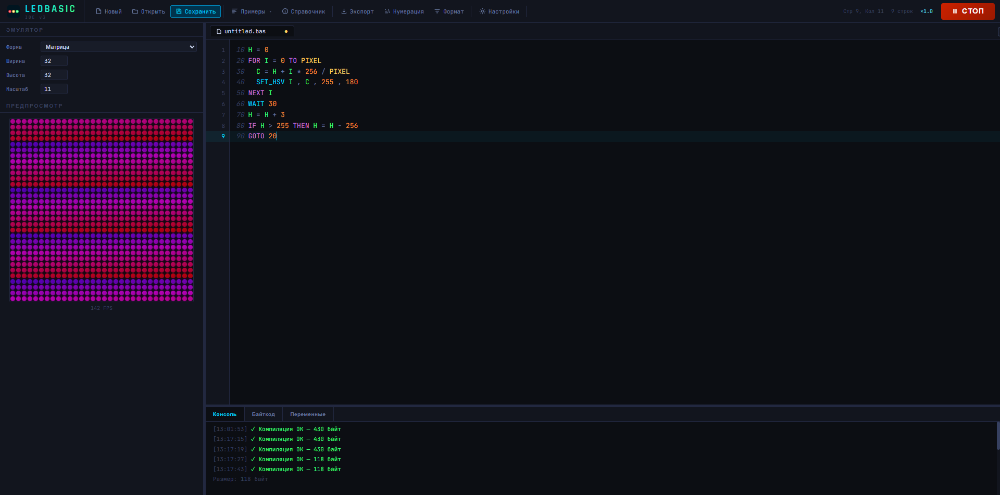
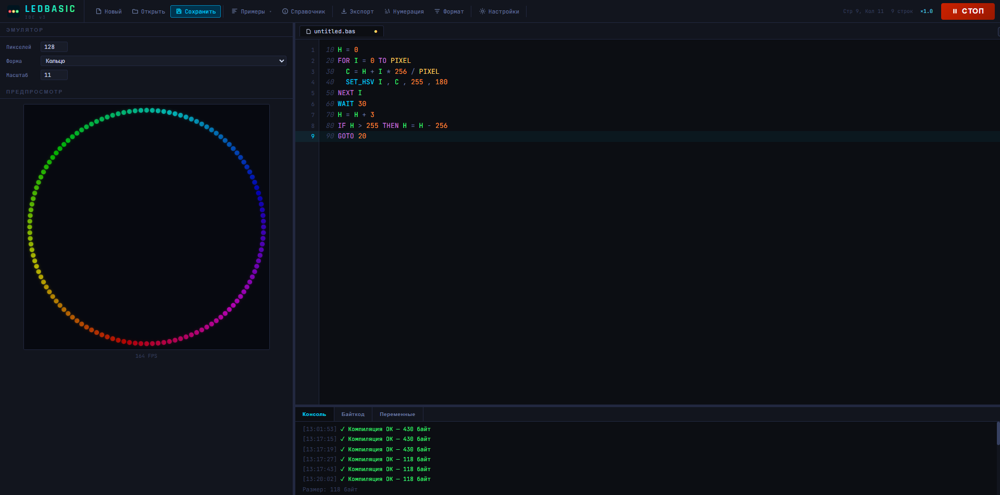

# LedBasic

**Встроенный интерпретатор BASIC-скриптов для LED-эффектов на ESP8266 и ESP32**

LedBasic — это неблокирующий скриптовый движок для создания анимаций на адресных светодиодных лентах WS2812B. Пишите эффекты в виде текстовых скриптов, компилируйте прямо на контроллере и запускайте параллельно с WiFi, MQTT, OTA и другими задачами.

[](https://www.arduino.cc/reference/en/libraries/)
[](https://github.com/esp8266/Arduino)
[](https://github.com/adafruit/Adafruit_NeoPixel)
[](https://github.com/FastLED/FastLED)
[](https://github.com/Makuna/NeoPixelBus)

---

## Возможности

| Категория | Описание |
|---|---|
| **Неблокирующее выполнение** | `tick()` в `loop()` — не мешает WiFi, MQTT, OTA |
| **Любой тип ленты** | Подключение через коллбэки |
| **Полный язык** | Переменные A–Z, арифметика, скобки, циклы FOR, условия IF, подпрограммы GOSUB |
| **LED-команды** | SET, SET_HSV, FILL, CLEAR, SHOW, WAIT, DELAY, FADE, MIRROR |
| **Математика** | SIN8, COS8, EXP8 (гамма), NOISE (2D Value Noise), MAP, CONSTRAIN, RND, ABS, MIN, MAX |
| **Скорость** | `setSpeed(percent)` масштабирует все задержки без изменения скрипта |
| **Оптимизации** | FastLED HSV, прямые указатели, линковка адресов GOTO → O(1), IRAM_ATTR |
| **IDE** | Браузерный редактор с эмулятором, отладчиком, примерами и справочником |

---

## Структура библиотеки

```ini
LedBasic/
├── src/
│   ├── LedBasic.h          — заголовочный файл
│   └── LedBasic.cpp        — реализация компилятора и VM
├── examples/
│   ├── 01_Rainbow/         — радуга со случайными вспышками
│   ├── 02_Comet/           — комета с хвостом
│   ├── 03_Fire/            — языки пламени (8 частиц)
│   ├── 04_Firework/        — фейерверк (5 искр)
│   ├── 05_Ants/            — муравьиная тропа
│   ├── 06_Sunset/          — закат (движущееся солнце)
│   └── 07_AllEffects/      — сборник 10 эффектов с автосменой
├── extras/
│   ├── LedBasic IDE/       — браузерная IDE
│   ├── Promt for AI/       — промты для AI
│   └── Screenshot/         — скриншоты
├── library.properties
├── keywords.txt
└── README.md
```

---

## Установка

1. Скачайте ZIP
2. Sketch → Include Library → Add .ZIP Library

### Аппаратная независимость
LedBasic ничего не знает о железе. Она не использует напрямую FastLED или NeoPixelBus. При создании объекта вы передаете ей коллбэки (функции обратного вызова) для установки цвета пикселя, вывода буфера на ленту и очистки. Это значит, что вы можете использовать абсолютно любую библиотеку для работы со светодиодами.
- [Adafruit NeoPixel](https://github.com/adafruit/Adafruit_NeoPixel)
- [FastLED](https://github.com/FastLED/FastLED)
- [NeoPixelBus](https://github.com/Makuna/NeoPixelBus)
- [ESP32 WS2812B](https://github.com/grzegorzwozny/ESP32-WS2812B)
- [Freenove WS2812](https://github.com/Freenove/Freenove_WS2812_Lib_for_ESP32)
---

## Быстрый старт

```cpp
#include <NeoPixelBus.h>
#include <LedBasic.h>

#define NUM_LEDS  60
#define DATA_PIN   3    // GPIO3 (RX) для DMA-метода

using MyStrip = NeoPixelBus<NeoGrbFeature, NeoEsp8266DmaWs2812xMethod>;
MyStrip strip(NUM_LEDS, DATA_PIN);

LedBasic basic(
    NUM_LEDS,
    [](uint16_t pos, uint8_t r, uint8_t g, uint8_t b) {
        strip.SetPixelColor(pos, RgbColor(r, g, b));
    },
    []{ strip.Show(); },
    []{ strip.ClearTo(RgbColor(0, 0, 0)); strip.Show(); }
);

const char* script =
    "10 H = 0\n"
    "20 FOR I = 0 TO PIXEL\n"
    "30   C = H + I * 256 / PIXEL\n"
    "40   SET_HSV I , C , 255 , 180\n"
    "50 NEXT I\n"
    "60 WAIT 30\n"
    "70 H = H + 3\n"
    "80 IF H > 255 THEN H = H - 256\n"
    "90 GOTO 20\n";

void setup() {
    Serial.end();       // ВАЖНО для DMA-метода: освобождает GPIO3
    strip.Begin();
    strip.Show();
    basic.compileFromText(script);
    basic.play();
}

void loop() {
    basic.tick();       // вся анимация здесь — не блокирует!
}
```

> **Важно для DMA-метода:** вызывай `Serial.end()` перед `strip.Begin()` — они используют один аппаратный модуль (GPIO3).
## C++ API

```cpp
// Компиляция и загрузка
bool compileFromText(const char* scriptText);   // из текста
bool loadBinMemory(const uint8_t* code);        // из байт-кода в RAM
bool loadBinFile(const char* path);             // из LittleFS

// Воспроизведение
void play();           // запуск с начала, сброс переменных A-Z
void stop();           // остановка + погасить ленту
void tick();           // шаг VM — вызывать каждый loop()

// Состояние и скорость
bool isRunning() const;
void     setSpeed(uint16_t percent);   // 1..1000, 100 = норма
uint16_t getSpeed() const;

// Управление скоростью
basic.setSpeed(100);   // нормальная скорость (по умолчанию)
basic.setSpeed(200);   // вдвое быстрее (задержки ÷2)
basic.setSpeed(50);    // вдвое медленнее (задержки ×2)
```

## Управление скоростью

```cpp
basic.setSpeed(100);   // нормальная скорость (по умолчанию)
basic.setSpeed(200);   // вдвое быстрее (задержки ÷2)
basic.setSpeed(50);    // вдвое медленнее (задержки ×2)
```

---

## Язык LedBasic

## Содержание
- [1. Синтаксис](#syntax)
- [2. Команды](#commands)
- [3. Операторы](#operators)
- [4. Функции](#functions)
- [5. Паттерны и рецепты](#patterns)
- [6. Примеры скриптов](#examples)

---

<a name="syntax"></a>
## 1. Синтаксис

### Структура программы

| Элемент | Формат | Описание |
|---|---|---|
| Строка | 10 команда | Начинается с номера 1–65534. Выполняется по порядку возрастания. |
| Комментарий | ' текст | Апостроф — всё до конца строки игнорируется. |
| Скобки | ( выражение ) | Группировка вычислений: (X + T) % 256 |
| Многострочность | 10 A=0  11 B=1 | Два оператора в одной текстовой строке (разделитель — два пробела). |


### Переменные


| Имя | Тип | Диапазон | Описание |
|---|---|---|---|
| A .. Z | int16 | -32768 .. 32767 | 26 переменных. Сбрасываются в 0 при play(). |

> 💡 Переменные — только одна буква A–Z. Нет массивов, строк, float. Для передачи параметров в подпрограммы используй глобальные переменные.

### Порядок выполнения

| Ситуация | Поведение |
|---|---|
| Следующая строка | Выполняется строка со следующим номером |
| GOTO / IF THEN GOTO | Переход на указанную строку |
| Конец программы | VM останавливается (isRunning() = false) |
| WAIT / DELAY | Прерывает tick() — следующий вызов продолжит |

---

<a name="commands"></a>
## 2. Команды

### LED — управление лентой


| Команда | Аргументы | Описание |
|---|---|---|
| SET | pos , r , g , b | Пиксель pos = RGB. r,g,b: 0..255. |
| SET_HSV | pos , h , s , v | Пиксель pos = HSV. Все 0..255. FastLED-алгоритм. |
| FILL | r , g , b | Залить всю ленту одним RGB-цветом. |
| CLEAR | — | Погасить всю ленту. Сбрасывает внутренний буфер. |
| SHOW | — | Вывести буфер на ленту без паузы. |
| WAIT | ms | SHOW + пауза ms мс. Основной способ показа кадра. |
| DELAY | ms | Пауза без SHOW. Для задержек между шагами. |
| FADE | pos , amt | Вычесть amt из R,G,B пикселя pos. Читает pixelBuf. Основа хвостов. |
| MIRROR | — | Скопировать пиксели 0..N/2-1 зеркально в конец ленты. |

```basic
10 SET_HSV 0 , 0 , 255 , 255    ' пиксель 0 = насыщ. красный
20 SET 5 , 0 , 0 , 255         ' пиксель 5 = синий RGB
30 FILL 0 , 80 , 0             ' вся лента = тёмно-зелёный
40 FADE 3 , 40                 ' пиксель 3 чуть темнее (хвост)
50 MIRROR                      ' отразить в другую половину
60 WAIT 100                    ' показать и подождать
```

> ⚠️ FADE и MIRROR читают внутренний буфер pixelBuf. Используй SET/SET_HSV/FILL — они синхронно обновляют буфер. CLEAR сбрасывает буфер в 0.

### Управление потоком

| Команда | Синтаксис | Описание |
|---|---|---|
| GOTO | GOTO n | Переход на строку n. n может быть переменной (GOTO A). |
| GOSUB | GOSUB n | Вызов подпрограммы. Стек 10 уровней. |
| RETURN | RETURN | Возврат из подпрограммы. |
| FOR | FOR v = a TO b STEP s | Цикл. STEP необязателен (=1). s может быть отрицательным. Вложенность до 8. |
| NEXT | NEXT v | Конец тела FOR. |
| IF | IF expr op expr THEN cmd | Условное выполнение одной команды. Операторы: == != > < >= <= |

```basic
10 FOR I = 0 TO PIXEL STEP 2   ' каждый второй пиксель
20   SET_HSV I , H , 255 , 200
30 NEXT I
40 IF H > 200 THEN GOSUB 500   ' условный вызов подпрограммы
50 GOTO 10
500 FILL 0 , 0 , 0
510 WAIT 500
520 RETURN
```

> ⚠️ IF выполняет только ОДНУ команду после THEN. Для блока — используй GOSUB.

---

<a name="operators"></a>
## 3. Операторы

### Арифметика

| Оператор | Пример | Описание |
|---|---|---|
| + | A + B | Сложение |
| - | A - B | Вычитание. Унарный минус: -A |
| * | A * B | Умножение. Переполнение int16 при результате >32767! |
| / | A / B | Целочисленное деление. B=0 → результат 0 (безопасно). |
| % | A % B | Остаток от деления (MOD). Полезен для цикличности. |

```basic
' % (MOD) — очень полезен:
30   R = I % 3          ' 0 для пикселей 0,3,6,...  1 для 1,4,7,...  2 для 2,5,8,...
40   H = T % 256        ' обёртка 0..255
50   Z = R % 2          ' чётность: 0 или 1
```

> ⚠️ Умножение: (uint8_t)255 * (int16_t)255 = 65025 — переполнение! Используй промежуточный расчёт: V = N * 4 / 7, а не N * 4 сразу если N может быть > 127.

### Операторы сравнения (только в IF)

| Оператор | Значение | Пример |
|---|---|---|
| == | равно | IF A == 0 THEN GOTO 10 |
| != | не равно | IF A != B THEN SET P , 255 , 0 , 0 |
| > | больше | IF H > 255 THEN H = H - 256 |
| < | меньше | IF V < 10 THEN GOSUB 500 |
| >= | не меньше | IF P >= PIXEL THEN P = 0 |
| <= | не больше | IF I <= N THEN GOTO 20 |

### Побитовые операторы

| Оператор | Пример | Описание |
|---|---|---|
| AND | X AND 255 | Побитовое И. Маскировка: K = I * 37 AND 255 |
| OR | A OR B | Побитовое ИЛИ. |

```basic
' Псевдослучайный сдвиг фазы (TwinkleFOX):
30   K = I * 37 AND 255    ' уникальный хэш для каждого пикселя
40   V = SIN8 T + K        ' каждый пиксель мерцает в своей фазе
```

### Приоритет операторов (от высшего к низшему)

| Уровень | Операторы | Направление |
|---|---|---|
| 1 (высший) | ( )  — скобки | изнутри наружу |
| 2 | унарный - | справа налево |
| 3 | *  /  % | слева направо |
| 4 (низший) | +  -  AND  OR | слева направо |

```basic
' Порядок вычислений без скобок:
H + I * 256 / PIXEL   →   H + ((I * 256) / PIXEL)   ✓ правильно
(H + I) * 256 / PIXEL →   ((H + I) * 256) / PIXEL   ← другой результат!
```

---

<a name="functions"></a>
## 4. Функции

### Математические функции

| Функция | Аргументы | Результат | Описание |
|---|---|---|---|
| ABS x | int16 | int16 ≥ 0 | Модуль. ABS -5 = 5 |
| MIN a , b | int16, int16 | int16 | Меньшее из двух |
| MAX a , b | int16, int16 | int16 | Большее из двух |
| RND min , max | int16, int16 | int16 | Случайное целое, включая границы |
| MAP val,i0,i1,o0,o1 | 5× int16 | int16 | Линейное масштабирование диапазона. Как Arduino map(). |
| CONSTRAIN val,lo,hi | 3× int16 | int16 | Обрезать до диапазона lo..hi. Как Arduino constrain(). |

```basic
' MAP: шум/SIN8 (0..255) → оттенок синей зоны (85..200)
50   H = MAP N , 0 , 255 , 85 , 200
' CONSTRAIN: защита после сложения двух шумов
60   V = CONSTRAIN N1 + N2 , 0 , 255
' MIN / MAX: обрезка яркости
70   V = MAX V , 0      ' не уйти в отрицательные
80   V = MIN V , 255    ' не превысить 255
```

### Тригонометрия

| Функция | Вход | Выход | Описание |
|---|---|---|---|
| SIN8 x | 0..255 | 0..255 | Синус. 256 значений = полный период (0→255→0→255→...). |
| COS8 x | 0..255 | 0..255 | Косинус. COS8 x = SIN8 (x + 64). |

```basic
' Бегущая синусоидальная волна:
20 FOR I = 0 TO PIXEL
30   V = SIN8 T + I * 8    ' T — фаза волны, I*8 — сдвиг по позиции
40   SET_HSV I , 160 , 255 , V
50 NEXT I
60 WAIT 20
70 T = T + 4
80 IF T > 255 THEN T = T - 256  ' плавная обёртка!
90 GOTO 20
```

### Гамма и шум

| Функция | Вход | Выход | Описание |
|---|---|---|---|
| EXP8 x | 0..255 | 0..255 | Гамма 2.2: round(255×(x/255)²·²). Делает яркость естественной. |
| NOISE x , t | 0..65535, 0..65535 | 0..255 | 2D Value Noise. x — позиция, t — время. Не сбрасывай t через 255! |

```basic
' EXP8: ключевые значения
' EXP8(0)=0  EXP8(64)=12  EXP8(128)=56  EXP8(192)=137  EXP8(255)=255
' Линейное дыхание → с EXP8: долго тёмный, резкий пик
20 V = SIN8 T
30 V = EXP8 V       ' добавить гамму = естественное дыхание

' NOISE: масштаб пространства
30   X = I * 25     ' крупные пятна (медленнее)
30   X = I * 80     ' мелкие детали (быстрее)
' Правильная обёртка T:
110 T = T + 5
120 IF T > 32000 THEN T = 0   ' НЕ T > 255 — иначе рывок!
```

### PIXEL и HSV-палитра

| Функция | Вход | Выход |
|---|---|---|
| PIXEL | — | num_leds − 1 (макс. индекс) |

| H (оттенок) | Цвет | H | Цвет |
|---|---|---|---|
| 0 | 🔴 Красный | 128 | 🩵 Голубой |
| 21 | 🟠 Оранжевый | 170 | 🔵 Синий |
| 42 | 🟡 Жёлтый | 192 | 🟣 Фиолетовый |
| 85 | 🟢 Зелёный | 213 | 💗 Пурпурный |

> 💡 S=255 — насыщенный цвет. S=0 — белый. V=255 — макс. яркость. V=0 — чёрный.

---

<a name="patterns"></a>
## 5. Паттерны и рецепты

### Бесконечный цикл анимации

```basic
100 ' ...рисуем кадр...
200 WAIT 30       ' показать + пауза
300 GOTO 100      ' следующий кадр
```

### Правильная обёртка счётчика

```basic
' ✓ ПРАВИЛЬНО для SIN8/COS8 (период 256):
70 T = T + 3
80 IF T > 255 THEN T = T - 256   ' плавный переход через 0

' ✓ ПРАВИЛЬНО для NOISE (длинный период):
120 T = T + 5
130 IF T > 32000 THEN T = 0      ' незаметный сброс

' ✗ НЕПРАВИЛЬНО для NOISE:
80 IF T > 255 THEN T = 0         ' рывок! NOISE(x,255) ≠ NOISE(x,0)
```

### Передача параметров в GOSUB

```basic
' Передача через глобальные переменные перед GOSUB:
110 V = A         ' яркость
111 P = I         ' позиция
112 GOSUB 600     ' вызов

600 IF V <= 0 THEN RETURN      ' guard clause
601 IF P > PIXEL THEN RETURN   ' защита от выхода за ленту
610 IF V > 200 THEN SET P , 255 , 255 , 255
611 IF V > 200 THEN RETURN
620 SET_HSV P , 0 , 255 , V
630 RETURN
```

### Хвост через FADE

```basic
' Перед каждым кадром тускнеем всю ленту:
100 FOR I = 0 TO PIXEL
110   FADE I , 30    ' 30 = короткий хвост, 8 = длинный
120 NEXT I
130 SET_HSV P , H , 255 , 255   ' рисуем голову
140 WAIT 25
```

### Декодирование пикселя матрицы 16×16 (змейка)

```basic
20 FOR I = 0 TO 255
30   R = I / 16          ' строка (0..15)
40   C = I % 16          ' столбец сырой (0..15)
50   Z = R % 2
60   IF Z == 1 THEN C = 15 - C   ' нечётные строки — зеркало!
70   X = C               ' X-координата (0..15)
80   Y = R               ' Y-координата (0..15)
90   ' ... рисуем пиксель I используя X и Y ...
100 NEXT I
```

### FBM — многооктавный шум

```basic
' Три октавы: крупные пятна + средняя рябь + мелкие детали
30   X = I * 25
40   N = NOISE X , T              ' октава 1: крупные
50   U = X * 3
60   B = NOISE U , T * 2          ' октава 2: мельче и быстрее
70   N = N * 2 + B
80   N = N / 3                    ' нормализация
```

### Конвейер обработки яркости

```basic
' 1. Генерация:  N = NOISE X , T          (0..255)
' 2. Масштаб:    H = MAP N , 0,255 , 85,200  (диапазон оттенка)
' 3. Защита:     N = CONSTRAIN N , 0 , 255   (гарантия диапазона)
' 4. Гамма:      V = EXP8 N                  (нелинейность глаза)
' 5. Вывод:      SET_HSV I , H , 255 , V
```

### Лимиты виртуальной машины

| Ресурс | Лимит |
|---|---|
| Переменные | 26 (A–Z), int16 |
| Строк программы | 128 |
| Стек GOSUB | 10 уровней |
| Вложенность FOR | 8 уровней |
| Байт-код | ~4 КБ |
| Скорость | setSpeed: 1..1000% |

---

<a name="examples"></a>
## 6. Примеры скриптов

**Радуга:**
```basic
10 H = 0
20 FOR I = 0 TO PIXEL
30   SET_HSV I , H + I * 8 , 255 , 180
40 NEXT I
50 WAIT 30
60 H = H + 3
70 IF H > 255 THEN H = H - 256
80 GOTO 20
```


**Огонь через NOISE:**
```basic
10 T = 0
20 FOR I = 0 TO PIXEL
30   X = I * 25
40   N = NOISE X , T
50   H = MAP N , 0 , 255 , 0 , 30
60   N = CONSTRAIN N , 0 , 255
70   V = EXP8 N
80   SET_HSV I , H , 255 , V
90 NEXT I
100 WAIT 25
110 T = T + 5
120 IF T > 32000 THEN T = 0
130 GOTO 20
```

**Комета с хвостом:**
```basic
10 H = 0
20 P = 0
30 FOR I = 0 TO PIXEL
40   FADE I , 35
50 NEXT I
60 SET_HSV P , H , 255 , 255
70 WAIT 30
80 P = P + 1
90 IF P <= PIXEL THEN GOTO 30
100 H = H + 40
110 IF H > 255 THEN H = H - 256
120 CLEAR
130 WAIT 300
140 P = 0
150 GOTO 30
```

---

## Браузерная IDE

Браузерная IDE для написания и тестирования скриптов на языке LedBasic. 
Откройте `extras/LedBasic IDE/index.html` в любом браузере — **без сервера, без установки**...
> Онлайн IDE [LedBasic](https://vktrsansara.github.io/LedBasic_IDE/).

**Возможности:**
- Редактор с подсветкой синтаксиса и нумерацией строк
- Эмулятор ленты (полоса / кольцо / матрица)
- Переменные A–Z в реальном времени
- Аннотированный байт-код
- 15 встроенных примеров
- Полный справочник языка
- Экспорт в `const char*`, PROGMEM, `.bas`, `.bin`
- Многострочный режим: `110 V = A  111 P = I  112 GOSUB 600`
- Горячие клавиши: `Ctrl+Enter` / `F5` — запуск, `Ctrl+S` — сохранить

**Скриншоты:**





---

## Оптимизации (v1.2)

- **FastLED HSV** — 5–10× быстрее стандартной конвертации
- **Линковка GOTO** — O(1) переходы после компиляции (вместо O(n) поиска)
- **Бинарный поиск** — для GOTO с переменным аргументом O(log n)
- **Прямые указатели** — `uint8_t* codePtr` вместо индекса `pc`
- **IRAM_ATTR** — горячие функции в IRAM ESP8266
- **Inline clamp8** — без ветвлений

---

## Лимиты VM

| Ресурс | Лимит |
|---|---|
| Переменные | 26 (A–Z), int16 |
| Строк программы | 128 |
| Стек GOSUB | 10 уровней |
| Вложенность FOR | 8 уровней |
| Байт-код | ~4 КБ |
| Скорость | 1..1000% |

---

## Дополнительно


---

## Опциональные библиотеки
- [LittleFS](https://arduino-esp8266.readthedocs.io/en/latest/filesystem.html) — хранение .bin скриптов (опционально)

---

## Благодарности

Эффекты вдохновлены проектом [WS2812FX](https://github.com/kitesurfer1404/WS2812FX) — kitesurfer1404.

---

## Лицензия

MIT — свободное использование, модификация и распространение.
